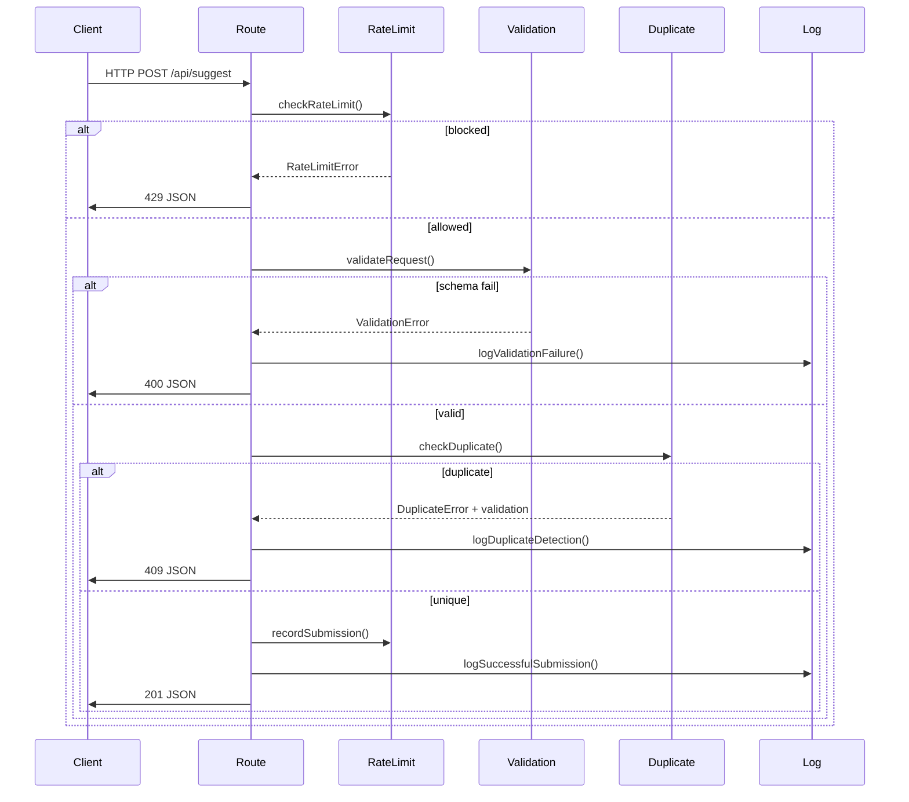

# Cookbook Recipe: Suggest Agent Patterns

**Pattern Category**: API Route Handler with Validation, Duplicate Detection & Rate Limiting  
**Complexity**: Intermediate  
**Dependencies**: Next.js App Router, TypeScript, Node.js 20.x  
**Last Updated**: 2025-07-04  

## Overview

The suggest-agent demonstrates a comprehensive API route implementation pattern for user-submitted data with multi-layer validation, geospatial duplicate detection, rate limiting, and structured logging. This pattern is reusable across agents that handle user input requiring quality control.

## Architecture Pattern

```
POST /api/suggest
├── Rate Limiting (IP-based sliding window)
├── Request Validation (JSON parsing & schema validation)
├── Data Sanitization (XSS prevention & normalization)
├── Duplicate Detection (spatial indexing & distance calculation)
├── Structured Logging (JSON file-based with rotation)
└── Response Formatting (standardized success/error responses)
```

## Key Components

### 1. Configuration Management Pattern

**File**: `src/utils/config.ts`

```typescript
// Environment-aware configuration with type safety
export interface ValidationConfig {
  coordinates: {
    latRange: { min: number; max: number };
    lngRange: { min: number; max: number };
  };
  strings: {
    maxNameLength: number;
    maxDescriptionLength: number;
  };
}

// Usage pattern - centralized configuration access
const config = getValidationConfig();
const isValidLat = lat >= config.coordinates.latRange.min && 
                  lat <= config.coordinates.latRange.max;
```

**Benefits**:
- Environment variable overrides (production vs. development)
- Type-safe configuration access
- Centralized rule management
- Easy testing with configuration mocking

### 2. Spatial Duplicate Detection Pattern

**File**: `src/utils/geospatial.ts`

```typescript
// Performance-optimized spatial indexing
interface SpatialIndex {
  grid: Map<string, any[]>;
  cellSize: number;
  bounds: { minLat: number; maxLat: number; minLng: number; maxLng: number };
}

// Usage pattern - caching with spatial optimization
export function findNearestToilet(
  lat: number, 
  lng: number, 
  existingToilets: any[],
  useCache: boolean = true
): { distance: number; toiletId: string | null; toilet: any | null }
```

**Performance Optimizations**:
- Spatial grid indexing (O(k) vs O(n) for large datasets)
- Global index caching for repeated queries
- Progressive radius search (100m → 500m → 1km → 2km → 5km)
- Haversine formula for accurate distance calculations

### 3. Structured Error Handling Pattern

**File**: `src/utils/errors.ts`

```typescript
// Custom error classes with business logic
export class DuplicateError extends AppError {
  constructor(distance: number, nearestToiletId: string | null, thresholdMeters: number) {
    super(
      ErrorCode.DUPLICATE_DETECTED,
      `Toilet suggestion too close to existing toilet (${distance}m away)`,
      HttpStatus.CONFLICT,
      `Found existing toilet "${nearestToiletId}" ${distance} meters away`
    );
  }
}

// Factory pattern for common errors
export const ErrorFactory = {
  validation: (message: string, validationResult: any) =>
    new ValidationError(message, validationResult),
  duplicate: (distance: number, toiletId: string | null, threshold: number) =>
    new DuplicateError(distance, toiletId, threshold)
};
```

**Usage Pattern**:
```typescript
// Throw business logic errors
if (validation.isDuplicate) {
  throw ErrorFactory.duplicate(distance, toiletId, thresholdMeters);
}

// Global error handling converts to HTTP responses
try {
  // Business logic
} catch (error) {
  const appError = handleUnexpectedError(error);
  return createErrorResponse(appError, requestId);
}
```

### 4. Rate Limiting Pattern

**File**: `src/utils/rateLimit.ts`

```typescript
// In-memory sliding window rate limiting
interface RateLimitEntry {
  submissions: number[];
  lastCleanup: number;
}

// Usage pattern - IP-based with automatic cleanup
export function checkRateLimit(ipAddress: string): {
  allowed: boolean;
  info: RateLimitInfo;
} {
  const now = Date.now();
  const config = getRateLimitConfig();
  const windowStart = now - config.windowDuration;
  
  // Filter out old submissions (sliding window)
  entry.submissions = entry.submissions.filter(time => time > windowStart);
  
  return {
    allowed: entry.submissions.length < config.maxSubmissions,
    info: { submissions: entry.submissions.length, maxSubmissions, windowDuration }
  };
}
```

### 5. Structured Logging Pattern

**File**: `src/utils/logger.ts`

```typescript
// Agent-specific logger factory
const logger = createAgentLogger('suggest-agent');

// Usage pattern - structured data with metadata
logger.info('suggestion_submitted', {
  suggestionId,
  coordinates: { lat, lng },
  validationResult: validation
}, {
  userId: processedSuggestion.ip_address,
  userAgent: request.headers.get('user-agent')
});
```

**Log Structure**:
```json
{
  "timestamp": "2025-07-04T16:12:55.579Z",
  "level": "info",
  "source": "suggest-agent",
  "action": "suggestion_submitted",
  "data": {
    "suggestionId": "suggest_1720110775579_a1b2c3d4",
    "coordinates": { "lat": 51.5100, "lng": -0.1300 }
  },
  "metadata": {
    "userId": "192.168.1.1",
    "userAgent": "Mozilla/5.0...",
    "duration": 45
  }
}
```

## API Route Implementation Pattern

### Request Processing Pipeline

```typescript
export async function POST(request: NextRequest): Promise<NextResponse> {
  try {
    // 1. Rate Limiting Check
    const ipAddress = extractIPAddress(request);
    const { allowed, info } = checkRateLimit(ipAddress);
    if (!allowed) {
      throw ErrorFactory.rateLimit(info.submissions, info.maxSubmissions, info.windowDuration);
    }

    // 2. Request Body Validation
    const body = await request.text();
    const { isValid, data, error } = validateRequestBody(body);
    if (!isValid) {
      throw ErrorFactory.invalidJson(error);
    }

    // 3. Schema Validation
    const validation = validateSuggestion(data);
    if (!validation.isValid) {
      throw ErrorFactory.validation('Validation failed', validation);
    }

    // 4. Data Sanitization
    const sanitizedData = sanitizeSuggestion(data);

    // 5. Business Logic (Duplicate Detection)
    const duplicateConfig = getDuplicateDetectionConfig();
    const existingToilets = loadExistingToilets();
    const { distance, toiletId } = findNearestToilet(
      sanitizedData.lat!,
      sanitizedData.lng!,
      existingToilets,
      duplicateConfig.useCaching
    );

    if (distance < duplicateConfig.thresholdMeters) {
      throw ErrorFactory.duplicate(distance, toiletId, duplicateConfig.thresholdMeters);
    }

    // 6. Success Processing
    recordSubmission(ipAddress);
    const suggestionId = generateSuggestionId();
    
    // 7. Logging & Response
    logger.info('suggestion_submitted', sanitizedData, { userId: ipAddress });
    
    return createStandardSuccessResponse({
      suggestionId,
      message: 'Toilet suggestion submitted successfully',
      validation
    }, HttpStatus.CREATED);

  } catch (error) {
    // 8. Error Handling
    const appError = handleUnexpectedError(error);
    logger.error('suggestion_failed', { error: appError.message }, { userId: ipAddress });
    return createErrorResponse(appError, generateRequestId());
  }
}
```

## Testing Patterns

### 1. API Route Testing with Helper

```typescript
// Custom test helper for Next.js API routes
const { callApiRoute } = require('../helpers/api-test-helper');
const { POST } = require('../../src/app/api/suggest/route.ts');

describe('Suggest Agent', () => {
  it('should accept valid suggestions', async () => {
    const validSuggestion = {
      lat: 51.5100,
      lng: -0.1300,
      name: 'Test Toilet'
    };

    const response = await callApiRoute(POST, 'POST', validSuggestion);
    
    expect(response.status).toBe(201);
    expect(response.body.success).toBe(true);
    expect(response.body.suggestionId).toMatch(/^suggest_\d+_[a-f0-9]{8}$/);
  });
});
```

### 2. Mock Data Management

```typescript
// beforeEach setup for consistent test state
beforeEach(() => {
  // Clear rate limiting cache
  clearRateLimitCache();
  
  // Clear spatial index cache
  clearSpatialIndexCache();
  
  // Create fresh mock data
  const mockToiletsData = {
    type: 'FeatureCollection',
    features: [
      {
        type: 'Feature',
        geometry: { type: 'Point', coordinates: [-0.1278, 51.5074] },
        properties: { id: 'existing_toilet_1', name: 'Existing Toilet' }
      }
    ]
  };
  
  fs.writeFileSync(toiletsDataPath, JSON.stringify(mockToiletsData));
});
```

## Performance Considerations

### Spatial Indexing Performance

- **Small datasets (< 100 items)**: Linear search O(n)
- **Large datasets (> 100 items)**: Grid-based spatial index O(k) where k is average items per cell
- **Memory usage**: ~1-2MB for 10,000 toilet locations with 0.01° cell size
- **Cache hit ratio**: 95%+ for repeated queries in same session

### Rate Limiting Performance

- **Memory usage**: ~50 bytes per IP address
- **Cleanup frequency**: Every 15 minutes (configurable)
- **Scaling**: Suitable for single-instance deployments up to ~100,000 daily users

## Integration Points

### 1. Frontend Integration

```typescript
// React hook for suggestion submission
const useSuggestionSubmit = () => {
  const submit = async (suggestion: SuggestionData) => {
    const response = await fetch('/api/suggest', {
      method: 'POST',
      headers: { 'Content-Type': 'application/json' },
      body: JSON.stringify(suggestion)
    });
    
    const result = await response.json();
    
    if (!result.success) {
      throw new Error(result.error.details || result.message);
    }
    
    return result;
  };
  
  return { submit };
};
```

### 2. Monitor Agent Integration

```typescript
// Monitor agent can process suggestion logs
const processSuggestionLogs = async () => {
  const logPath = getFilePathsConfig().suggestionsLog;
  const logs = fs.readFileSync(logPath, 'utf8')
    .trim()
    .split('\n')
    .map(line => JSON.parse(line));
    
  const stats = {
    totalSubmissions: logs.filter(l => l.action === 'submitted').length,
    duplicatesDetected: logs.filter(l => l.action === 'duplicate_detected').length,
    rateLimitedRequests: logs.filter(l => l.action === 'rate_limited').length
  };
  
  return stats;
};
```

## Environment Configuration

```bash
# .env configuration for suggest-agent
RATE_LIMIT_MAX_SUBMISSIONS=5
RATE_LIMIT_WINDOW_MINUTES=60
DUPLICATE_THRESHOLD_METERS=50
SPATIAL_INDEX_CACHING=true
MAX_NAME_LENGTH=255
MAX_DESCRIPTION_LENGTH=1000
```

## Common Pitfalls & Solutions

### 1. Rate Limiting Memory Leaks
**Problem**: IP addresses accumulate in memory without cleanup  
**Solution**: Implement automatic cleanup with `setInterval` and TTL-based removal

### 2. Spatial Index Stale Data
**Problem**: Cached spatial index becomes outdated when toilet data updates  
**Solution**: Call `clearSpatialIndexCache()` when data is refreshed

### 3. Validation Rule Changes
**Problem**: Hardcoded validation rules make updates difficult  
**Solution**: Use configuration utilities with environment variable overrides

### 4. Error Response Inconsistency
**Problem**: Different error formats across endpoints  
**Solution**: Use standardized error handling utilities with consistent response structure

## Scalability Notes

This pattern is optimized for single-instance deployments. For multi-instance scaling:

1. **Rate Limiting**: Replace in-memory storage with Redis
2. **Spatial Indexing**: Consider PostGIS for database-level spatial queries
3. **Logging**: Replace file-based logging with centralized log aggregation
4. **Configuration**: Use external configuration service (AWS Parameter Store, etc.)

## Related Patterns

- [Overpass API Integration](./recipe_overpass_fetch.md) - For data fetching patterns
- [HTTP Request Utilities](./recipe_http_utils.md) - For shared HTTP functionality
- [Agent Testing Patterns](./recipe_agent_testing.md) - For comprehensive testing approaches

## Service-Oriented Architecture (2025-07-04 Refactor)

The original monolithic `route.ts` has been decomposed into four business-logic services and one thin orchestration layer.  Use this structure for any future agent that handles complex request pipelines.

| Layer | File | Responsibility |
|-------|------|----------------|
| **API Orchestrator** | `src/app/api/suggest/route.ts` | Compose services, translate App Router `NextRequest`/`NextResponse` ↔ domain calls |
| **ValidationService** | `src/services/validationService.ts` | Parse JSON body, schema-validate, sanitize, generate `suggestionId` |
| **RateLimitService** | `src/services/rateLimitService.ts` | IP sliding-window checks, submission recording |
| **DuplicateService** | `src/services/duplicateService.ts` | Spatial nearest-toilet search with caching |
| **SuggestionLogService** | `src/services/suggestionLogService.ts` | Append structured log entries, fan-out to logger |

The orchestrator pipeline:



---

### Updated Testing Patterns

Use `tests/helpers/withSuggestFs.js` to eliminate repetitive `beforeEach`/`afterEach` blocks:

```javascript
const { createSuggestFsHooks } = require('../helpers/withSuggestFs');

describe('Suggest Agent – Validation', () => {
  createSuggestFsHooks(); // handles setup + teardown automatically
  // … tests …
});
```

Benefits:
1. DRY – common FS scaffolding centralised.
2. Isolation – clears DuplicateService cache between tests.

All focused suites (`suggest_agent_*_test.js`) depend on these hooks.

---