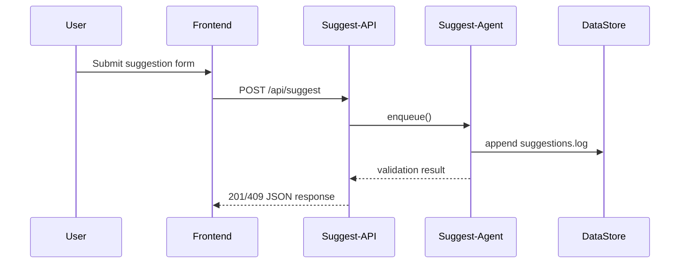

# Architecture Overview (Explanation)

This document consolidates the *Atomic Principles Spec Sheet* (formerly `architecture-spec.md`) with the high-level context and decisions recorded in **ADR-001**. For the canonical decision record, see `docs/adr/ADR-001.md`.

The CityPee MVP architecture is an AI-driven micro-services setup orchestrating data ingest, suggestion validation, SEO page generation, deployment, and monitoring. It embraces KISS, DRY, and SOLID principles while staying lightweight for rapid iteration.

## Key Components

1. **Agents** – Five GPT-backed agents (ingest, suggest, SEO, deploy, monitor) triggered by cron, webhooks, or CI events.
2. **Datasets** – Primary GeoJSON (`toilets.geojson`) plus append-only logs for suggestions.
3. **Frontend** – Next.js App-Router with React-Leaflet and TailwindCSS.
4. **Infrastructure** – Optional Docker, Vercel auto-deploy, GitHub Actions for CI.

Refer to the individual agent manifests in `agents/` for runtime prompts and schedules.

## Runtime Data Flow

## Operational Constraints

* **Cold Start**: initial Vercel cold start must be < 500 ms to avoid user drop-off.  
* **Rate Limits**: Overpass fetches capped at 2/min; monitor-agent uses exponential back-off.  
* **GeoJSON Size**: keep under 500 KB per city; split by borough if bigger.

---

*Further architectural evolution is captured in subsequent ADRs housed under `docs/adr/`.* 