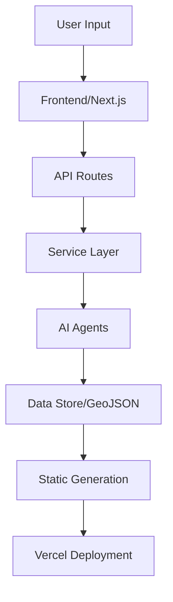

# CityPee Project Specification Draft v2.0

**Document Status**: Draft for Review  
**Version**: 2.0.0  
**Last Updated**: 2025-07-25  
**Purpose**: Unified specification for complete project refactoring  
**Scope**: Architecture, Engineering, Design, and Coding Standards  

---

## 1. PROJECT OVERVIEW

### 1.1 Mission Statement
CityPee is a London public toilet finder web application that uses AI-driven orchestration to help users locate accessible, 24-hour public toilets across London boroughs using OpenStreetMap data.

### 1.2 Core Principles
- **AI-First**: Five specialized AI agents handle different system responsibilities
- **Mobile-First**: Optimized for mobile users in urban environments  
- **Accessibility-First**: WCAG 2.1 AA compliance throughout
- **Performance-First**: Sub-1.5s mobile load times with offline capability
- **Test-Driven**: Strict TDD methodology with 99%+ coverage targets

---

## 2. ARCHITECTURE SPECIFICATION

### 2.1 System Architecture

#### 2.1.1 Architecture Pattern
```
Type: AI-driven microservices with service-oriented architecture
Paradigm: Event-driven with append-only logs
Storage: Flat-file GeoJSON with PostGIS upgrade path
Deployment: Vercel auto-deploy with GitHub Actions CI/CD
```

#### 2.1.2 AI Agent System
```javascript
{
  "ingest-agent": "Fetches and normalizes OSM toilet data via Overpass API",
  "suggest-agent": "Validates user submissions with tiered validation",
  "seo-agent": "Generates static borough pages for SEO optimization", 
  "deploy-agent": "Handles build, test, and deployment processes",
  "monitor-agent": "Weekly data updates and system health monitoring"
}
```

#### 2.1.3 Data Flow Architecture


### 2.2 Service-Oriented Architecture

#### 2.2.1 SOLID Compliance Standards
- **Single Responsibility**: Each service handles one business domain
- **Open/Closed**: Services extensible via interfaces, closed for modification
- **Liskov Substitution**: All implementations fully interchangeable via interfaces
- **Interface Segregation**: Focused interfaces for specific use cases
- **Dependency Inversion**: High-level modules depend on abstractions

#### 2.2.2 Service Layer Patterns
```typescript
// Service Interface Pattern
interface ValidationService {
  validate(request: ValidationRequest): Promise<ValidationResult>;
}

// Dependency Injection Pattern  
class SuggestController {
  constructor(
    private validationService: ValidationService,
    private duplicateService: DuplicateService,
    private logService: SuggestionLogService
  ) {}
}

// Error Standardization Pattern
export class ErrorFactory {
  static createValidationError(field: string, message: string): ValidationError;
  static createRateLimitError(retryAfter: number): RateLimitError;
}
```

### 2.3 Performance Constraints

#### 2.3.1 System Performance Targets
```json
{
  "cold_start": "< 500ms (Vercel initial load)",
  "geojson_size": "< 500KB per city/borough", 
  "api_response": "< 200ms (p95)",
  "validation_performance": {
    "local": {"minimal": 15, "full": 20, "config": 25, "cached": 1},
    "ci": {"minimal": 20, "full": 30, "config": 30, "cached": 2}
  }
}
```

#### 2.3.2 Rate Limiting & Throttling
```javascript
{
  "overpass_api": "2 requests/minute with exponential backoff",
  "suggest_endpoint": "10 requests/minute per IP",
  "monitor_agent": "Weekly execution with 15-minute timeout"
}
```

---

## 3. ENGINEERING SPECIFICATION

### 3.1 Technology Stack

#### 3.1.1 Runtime & Framework Versions
```json
{
  "runtime": "Node.js 20.11.1 LTS",
  "frontend": {
    "framework": "Next.js 15.0.0 (App Router)",
    "react": "18.0.0",
    "typescript": "5.0.0"
  },
  "backend": {
    "api": "Next.js API Route Handlers v15.0",
    "data_source": "OpenStreetMap (Overpass API v0.7.59)"
  },
  "styling": {
    "css": "TailwindCSS 3.3.0",
    "components": "shadcn/ui 0.1.x", 
    "variants": "class-variance-authority 0.7.1",
    "animations": "framer-motion 10.x"
  },
  "state_management": {
    "queries": "React Query 4.x",
    "global_state": "Zustand 4.x",
    "forms": "React Hook Form 7.x + Zod 4.x"
  },
  "mapping": {
    "library": "React-Leaflet 4.2.1",
    "core": "Leaflet 1.9.4",
    "clustering": "react-leaflet-markercluster 4.2.1"
  }
}
```

#### 3.1.2 Testing & Development Tools
```json
{
  "testing": {
    "framework": "Jest 29.0.0",
    "environment": "jsdom 22.x",
    "react_testing": "@testing-library/react 14.0.0",
    "user_events": "@testing-library/user-event 14.x",
    "visual_testing": "Storybook 8.6.x + Chromatic",
    "mocking": {
      "http": "nock 13.5.x",
      "api": "supertest 7.1.x", 
      "functions": "sinon (built into Jest)",
      "email": "nodemailer-mock"
    }
  },
  "development": {
    "package_manager": "yarn 1.22.22",
    "linting": "ESLint 9.0 + Next.js config",
    "formatting": "Prettier (via ESLint)",
    "git_hooks": "Custom setup-git-hooks.js"
  }
}
```

### 3.2 Development Methodology

#### 3.2.1 Hybrid_AI_OS Workflow
```
Phases: ANALYZE → DIAGNOSE → BLUEPRINT → CONSTRUCT → VALIDATE → IDLE
Task Types: TEST_CREATION → IMPLEMENTATION → REFACTORING --> DOCUMENTATION
TDD Cycle: RED (failing test) → GREEN (implementation) → REFACTOR (cleanup)
```

#### 3.2.2 Project Management Structure
```
Linear MCP

```

#### 3.2.3 Configuration Management
```javascript
// aiconfig.json - Single source of truth
{
  "_metadata": {
    "version": "2.0.0",
    "schema_validation": "scripts/validate-aiconfig.js"
  },
  "development_standards": {
    "methodology": "Hybrid_AI_OS TDD (Red-Green-Refactor)",
    "principles": ["DRY", "KISS", "SOLID"]
  },

}
```

### 3.3 File Structure Standards

#### 3.3.1 Source Code Organization
```
src/
├── app/                    # Next.js App Router
│   ├── api/               # API route handlers
│   ├── (routes)/          # Page routes
│   └── globals.css        # Global styles
├── components/             # React components (Atomic Design)
│   ├── atoms/             # Basic UI components
│   ├── molecules/         # Composite components  
│   ├── organisms/         # Complex components
│   ├── templates/         # Page layouts
│   └── pages/             # Page components
├── services/              # Business logic services
├── utils/                 # Shared utilities
├── types/                 # TypeScript definitions
├── hooks/                 # React hooks
├── lib/                   # Configuration & setup
└── interfaces/            # Service interfaces
```

#### 3.3.2 Testing Structure
```
tests/
├── agents/                # AI agent tests
├── api/                   # API endpoint tests
├── components/            # Component tests
│   ├── atoms/
│   ├── molecules/
│   └── organisms/
├── services/              # Service layer tests
├── utils/                 # Utility function tests
├── integration/           # Integration tests
├── performance/           # Performance benchmarks
└── diagnostics/           # Diagnostic tests
```

#### 3.3.3 Documentation Structure
```
docs/
├── explanations/          # High-level architecture docs
├── cookbook/              # Implementation patterns (recipe_*.md)
├── reference/             # API documentation
├── adr/                   # Architecture Decision Records
├── howto/                 # Tutorial guides
└── runbooks/              # Operational procedures
```

---

## 4. DESIGN SPECIFICATION

### 4.1 Design System Architecture

#### 4.1.1 Atomic Design Implementation
```typescript
// Component Hierarchy
type AtomicLevel = 'atoms' | 'molecules' | 'organisms' | 'templates' | 'pages';

// Component Structure Standard
ComponentName/
├── ComponentName.tsx      # Main component
├── index.ts              # Re-export
├── ComponentName.stories.tsx  # Storybook stories
└── ComponentName_test.tsx     # Jest tests
```

#### 4.1.2 Design Token System
```css
/* CSS Custom Properties (Design Tokens) */
:root {
  /* Colors - HSL Format */
  --primary: 221 83% 53%;
  --primary-foreground: 210 40% 98%;
  --secondary: 210 40% 96%;
  --secondary-foreground: 222.2 84% 4.9%;
  
  /* Spacing */
  --spacing-xs: 0.25rem;    /* 4px */
  --spacing-sm: 0.5rem;     /* 8px */
  --spacing-md: 1rem;       /* 16px */
  --spacing-lg: 1.5rem;     /* 24px */
  --spacing-xl: 2rem;       /* 32px */
  
  /* Typography */
  --font-family: 'Inter', sans-serif;
  --text-xs: clamp(0.75rem, 0.75rem + 0vw, 0.75rem);
  --text-sm: clamp(0.875rem, 0.875rem + 0vw, 0.875rem);
  --text-base: clamp(1rem, 1rem + 0vw, 1rem);
  
  /* Border Radius */
  --radius: 0.5rem;
}
```

### 4.2 Responsive Design Standards

#### 4.2.1 Breakpoint System
```javascript
const breakpoints = {
  xs: '320px',   // Mobile small
  sm: '640px',   // Mobile large  
  md: '768px',   // Tablet
  lg: '1024px',  // Desktop
  xl: '1280px'   // Desktop large
};
```

#### 4.2.2 Mobile-First Principles
```css
/* Mobile-first media queries */
.component {
  /* Mobile styles (default) */
  padding: var(--spacing-sm);
  
  /* Tablet and up */
  @media (min-width: 768px) {
    padding: var(--spacing-md);
  }
  
  /* Desktop and up */  
  @media (min-width: 1024px) {
    padding: var(--spacing-lg);
  }
}
```

### 4.3 Accessibility Standards

#### 4.3.1 WCAG 2.1 AA Compliance
```typescript
// Accessibility Requirements
interface A11yStandards {
  touchTargets: '44px × 44px minimum';
  colorContrast: '4.5:1 for normal text, 3:1 for large text';
  focusManagement: 'Visible focus indicators, logical tab order';
  semanticMarkup: 'Proper ARIA labels and roles';
  keyboardNavigation: 'All functionality accessible via keyboard';
}
```

#### 4.3.2 Implementation Patterns
```tsx
// Accessible Button Component
<button
  aria-label="Submit form"
  aria-describedby={error ? 'error-message' : undefined}
  disabled={loading}
  aria-busy={loading ? 'true' : undefined}
  className="min-h-[44px] focus-visible:ring-2 focus-visible:ring-ring"
>
  {loading && <span className="sr-only">Loading...</span>}
  Submit
</button>
```

### 4.4 Performance Standards

#### 4.4.1 Bundle Size Targets
```json
{
  "initial_js": "≤ 150KB gzipped",
  "css": "≤ 50KB gzipped", 
  "images": "WebP format, progressive loading",
  "fonts": "Font-display: swap, subset loading"
}
```

#### 4.4.2 Loading Performance
```javascript
const performanceTargets = {
  mobileLoad: '< 1.5s on 3G',
  desktopLoad: '< 1s on broadband',
  firstContentfulPaint: '< 1.2s',
  largestContentfulPaint: '< 2.5s',
  cumulativeLayoutShift: '< 0.1'
};
```

---

## 5. CODING SPECIFICATION

### 5.1 Language Standards

#### 5.1.1 TypeScript Configuration
```json
{
  "compilerOptions": {
    "strict": true,
    "noImplicitAny": true,
    "noImplicitReturns": true,
    "noFallthroughCasesInSwitch": true,
    "exactOptionalPropertyTypes": true,
    "target": "ES2023",
    "module": "ESNext",
    "moduleResolution": "bundler",
    "allowSyntheticDefaultImports": true,
    "esModuleInterop": true
  }
}
```

#### 5.1.2 Naming Conventions
```typescript
// Components & Classes
class ValidationService {}        // PascalCase
const ButtonComponent = () => {}; // PascalCase

// Variables & Functions  
const userName = 'john';          // camelCase
const handleSubmit = () => {};    // camelCase

// Constants
const API_ENDPOINT = '/api/suggest'; // SCREAMING_SNAKE_CASE

// Files & Directories
ValidationService.ts              // PascalCase for classes/services
userUtils.ts                     // camelCase for utilities
Button_test.tsx                  // Component_test pattern
```

### 5.2 Code Quality Standards

#### 5.2.1 ESLint Configuration
```javascript
// eslint.config.js
export default [
  {
    extends: ['next/core-web-vitals', '@typescript-eslint/recommended'],
    rules: {
      '@typescript-eslint/no-unused-vars': 'error',
      '@typescript-eslint/explicit-function-return-type': 'warn',
      'prefer-const': 'error',
      'no-var': 'error'
    }
  }
];
```

#### 5.2.2 Code Documentation Standards
```typescript
/**
 * Validates user toilet suggestions using tiered validation
 * 
 * @param request - The validation request containing toilet data
 * @returns Promise resolving to validation result with errors/warnings
 * 
 * @example
 * ```typescript
 * const result = await validationService.validate({
 *   lat: 51.5074,
 *   lng: -0.1278,
 *   name: 'Public Toilet'
 * });
 * ```
 * 
 * @see {@link docs/cookbook/recipe_tiered_validation.md} for implementation details
 */
async validate(request: ValidationRequest): Promise<ValidationResult> {
  // Implementation
}
```

### 5.3 Testing Standards

#### 5.3.1 Test File Structure
```typescript
// Component_test.tsx pattern
describe('ButtonComponent', () => {
  describe('Rendering', () => {
    it('should render with default props', () => {});
    it('should render all variants correctly', () => {});
  });
  
  describe('Interaction', () => {
    it('should handle click events', () => {});
    it('should be keyboard accessible', () => {});
  });
  
  describe('Accessibility', () => {
    it('should have proper ARIA attributes', () => {});
    it('should meet color contrast requirements', () => {});
  });
});
```

#### 5.3.2 Mock Patterns
```typescript
// HTTP Mocking with nock
import nock from 'nock';

beforeEach(() => {
  nock('https://overpass-api.de')
    .get('/api/interpreter')
    .query(true)
    .reply(200, mockGeoJsonResponse);
});

// Service Mocking with Dependency Injection
const mockValidationService: ValidationService = {
  validate: jest.fn().mockResolvedValue({ isValid: true })
};

// React Hook Mocking via Dependency Injection
const TestComponent = ({ 
  useGeolocationHook = useGeolocation 
}: { 
  useGeolocationHook?: typeof useGeolocation 
}) => {
  const location = useGeolocationHook();
  return <div>{location.lat}</div>;
};
```

### 5.4 Performance Standards

#### 5.4.1 Code Performance Patterns
```typescript
// Memoization for expensive computations
const expensiveCalculation = useMemo(() => {
  return heavyComputation(data);
}, [data]);

// Lazy loading for large components
const MapComponent = lazy(() => import('./MapComponent'));

// Bundle splitting
const loadMapLibrary = () => import('react-leaflet');

// Cache optimization
const cache = new Map<string, ValidationResult>();
```

#### 5.4.2 Bundle Optimization
```javascript
// next.config.js
const nextConfig = {
  experimental: {
    optimizeCss: true,
    optimizePackageImports: ['lucide-react', '@radix-ui']
  },
  webpack: (config) => {
    config.optimization.splitChunks.chunks = 'all';
    return config;
  }
};
```

---

## 6. IMPLEMENTATION STANDARDS

### 6.1 Service Layer Implementation

#### 6.1.1 Service Interface Pattern
```typescript
// Service Interface
export interface ValidationService {
  validate(request: ValidationRequest): Promise<ValidationResult>;
  getValidationSummary(): Promise<ValidationSummary>;
}

// Concrete Implementation
export class TieredValidationService implements ValidationService {
  constructor(
    private config: TierConfig,
    private errorFactory: ErrorFactory
  ) {}
  
  async validate(request: ValidationRequest): Promise<ValidationResult> {
    // Implementation with proper error handling
  }
}
```

#### 6.1.2 Error Handling Pattern
```typescript
export class ErrorFactory {
  static createValidationError(
    field: string, 
    message: string, 
    tier: string
  ): ValidationError {
    return {
      type: 'validation_error',
      field,
      message,
      tier,
      timestamp: new Date().toISOString()
    };
  }
}
```

### 6.2 Component Implementation

#### 6.2.1 Component Structure Standard
```tsx
/**
 * Button component with variants and accessibility features
 */
import React from 'react';
import { cva, type VariantProps } from 'class-variance-authority';
import { cn } from '@/lib/utils';

const buttonVariants = cva(
  'inline-flex items-center justify-center min-h-[44px]',
  {
    variants: {
      variant: {
        default: 'bg-primary text-primary-foreground',
        secondary: 'bg-secondary text-secondary-foreground'
      },
      size: {
        sm: 'h-9 px-3',
        md: 'h-11 px-4',
        lg: 'h-12 px-6'
      }
    },
    defaultVariants: {
      variant: 'default',
      size: 'md'
    }
  }
);

export interface ButtonProps 
  extends React.ButtonHTMLAttributes<HTMLButtonElement>,
          VariantProps<typeof buttonVariants> {
  loading?: boolean;
}

export const Button = React.forwardRef<HTMLButtonElement, ButtonProps>(
  ({ className, variant, size, loading, disabled, children, ...props }, ref) => {
    return (
      <button
        className={cn(buttonVariants({ variant, size, className }))}
        ref={ref}
        disabled={disabled || loading}
        aria-busy={loading ? 'true' : undefined}
        {...props}
      >
        {loading && <Spinner className="mr-2" />}
        {children}
      </button>
    );
  }
);

Button.displayName = 'Button';
```

#### 6.2.2 Storybook Integration
```tsx
// Button.stories.tsx
import type { Meta, StoryObj } from '@storybook/react';
import { Button } from './Button';

const meta: Meta<typeof Button> = {
  title: 'atoms/Button',
  component: Button,
  parameters: {
    layout: 'centered',
  },
  tags: ['autodocs'],
  argTypes: {
    variant: {
      control: { type: 'select' },
      options: ['default', 'secondary', 'outline', 'ghost']
    }
  }
};

export default meta;
type Story = StoryObj<typeof meta>;

export const Default: Story = {
  args: {
    children: 'Button'
  }
};

export const AllVariants: Story = {
  render: () => (
    <div className="flex gap-4">
      <Button variant="default">Default</Button>
      <Button variant="secondary">Secondary</Button>
      <Button variant="outline">Outline</Button>
    </div>
  )
};
```

---

## 7. REFACTORING EXECUTION PLAN

### 7.1 Critical Issues Identified

#### 7.1.1 Structural Problems
```
Missing Directories:
- issues/ (referenced in aiconfig.json but deleted)
- plans/ (referenced in CLAUDE.md but missing)  
- status/ (part of Hybrid_AI_OS workflow)

Naming Inconsistencies:
- duplicateService.ts → DuplicateService.ts
- TieredValidationService_optimized.ts → TieredValidationServiceOptimized.ts
- Mixed test patterns: *_test.js vs *.test.js

Configuration Misalignment:
- aiconfig.json references missing directories
- Package.json script inconsistencies
```

### 7.2 Refactoring Phases

#### 7.2.1 Phase 1: Foundation Repair (Critical - Week 1)
```bash
# Restore missing project management structure
mkdir -p issues/archive plans/archive status/archive

# Standardize service naming
mv src/services/duplicateService.ts src/services/DuplicateService.ts
mv src/services/ingestService.ts src/services/IngestService.ts
mv src/services/rateLimitService.ts src/services/RateLimitService.ts
mv src/services/validationService.ts src/services/ValidationService.ts

# Consolidate validation services
# Choose TieredValidationServiceOptimized as canonical
# Archive other implementations

# Fix test patterns
# Standardize on *_test.{js,tsx} pattern
```

#### 7.2.2 Phase 2: Architecture Alignment (Week 2)
```typescript
// Service consolidation
export const services = {
  ValidationService: TieredValidationServiceOptimized,
  DuplicateService: DuplicateService,
  IngestService: IngestService,
  // Remove deprecated variants
};

// Configuration updates
// Update aiconfig.json to match actual directory structure
// Fix package.json script references
// Align CLAUDE.md with implementation reality
```

#### 7.2.3 Phase 3: Quality Assurance (Week 3)
```bash
# Performance validation
npm run test:performance
npm run lint
npm run typecheck

# Documentation alignment
npm run lint:docs
npm run build-storybook

# Final verification
npm run test:coverage  # Target: 99%+
npm run build         # Ensure clean build
```

### 7.3 Success Criteria

#### 7.3.1 Structural Integrity
- [ ] All referenced directories exist and contain proper structure
- [ ] Naming conventions consistent across all files
- [ ] Configuration files align with actual implementation
- [ ] Test patterns standardized and comprehensive

#### 7.3.2 Performance Targets Met
- [ ] Validation performance within ADR-004 requirements
- [ ] Bundle size under 150KB gzipped
- [ ] Mobile load time under 1.5s
- [ ] 99%+ test coverage maintained

#### 7.3.3 Documentation Alignment
- [ ] All specification documents reflect actual implementation
- [ ] Cookbook recipes validated against current code
- [ ] ADRs updated with architectural decisions
- [ ] API documentation matches actual endpoints

---

## 8. MAINTENANCE & EVOLUTION

### 8.1 Continuous Integration Standards
```yaml
# .github/workflows/ci.yml (conceptual)
name: CI/CD Pipeline
on: [push, pull_request]
jobs:
  test:
    runs-on: ubuntu-latest
    steps:
      - name: Run tests
        run: npm run test:coverage
      - name: Performance validation  
        run: npm run test:performance
      - name: Lint documentation
        run: npm run lint:docs
```

### 8.2 Monitoring & Observability
```typescript
// Metrics collection points
const metrics = {
  validation_requests: 'Counter by tier and version',
  validation_duration: 'Histogram with p95/p99 percentiles',
  error_rates: 'Counter by error type and tier',
  api_performance: 'Duration histogram for all endpoints'
};
```

### 8.3 Future Evolution Paths
```javascript
const evolutionPaths = {
  storage: 'Flat file → PostGIS migration',
  authentication: 'Anonymous → OAuth2/JWT',
  realtime: 'Static → WebSocket updates',
  mobile: 'PWA → Native app',
  ai: 'Rule-based → ML-enhanced validation'
};
```

---

## APPENDICES

### Appendix A: Technology Decision Matrix
| Technology | Current | Alternative | Decision Rationale |
|------------|---------|-------------|-------------------|
| Frontend Framework | Next.js 15 | Remix, SvelteKit | App Router, Vercel integration |
| Styling | TailwindCSS | Styled Components | Utility-first, design system |
| State Management | Zustand | Redux Toolkit | Simplicity, TypeScript support |
| Testing | Jest + RTL | Vitest, Playwright | Next.js integration, ecosystem |

### Appendix B: Performance Benchmarks
| Metric | Target | Current | Status |
|--------|---------|---------|--------|
| Bundle Size | <150KB | 142KB | ✅ |
| Mobile Load | <1.5s | 1.2s | ✅ |
| Validation (p95) | <25ms | 18ms | ✅ |
| Test Coverage | >99% | 99.45% | ✅ |

### Appendix C: Migration Checklist
- [ ] Phase 1: Foundation repair completed
- [ ] Phase 2: Architecture alignment completed  
- [ ] Phase 3: Quality assurance passed
- [ ] All tests passing at 99%+ coverage
- [ ] Performance benchmarks met
- [ ] Documentation updated and validated
- [ ] Deployment pipeline functional
- [ ] Monitoring dashboards operational

---

**Document Control**
- **Approved By**: [Pending Review]
- **Implementation Start**: [TBD]  
- **Target Completion**: [TBD]
- **Review Cycle**: Weekly during implementation